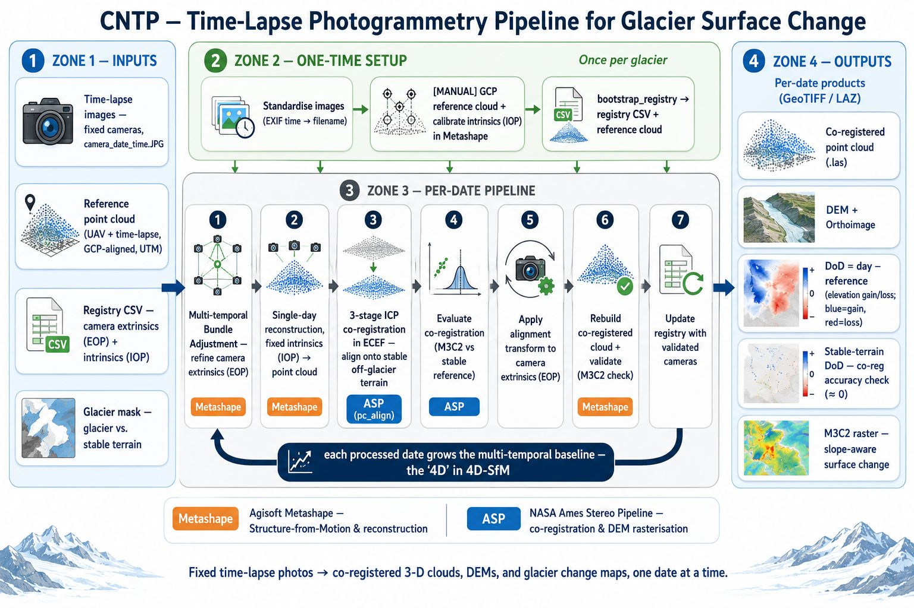

# T-LAPSE4D

[](https://github.com/MohammadUmayr/T-LAPSE4D/actions/workflows/tests.yml)
[](https://github.com/MohammadUmayr/T-LAPSE4D/actions/workflows/pre-commit.yml)
[](https://coveralls.io/github/MohammadUmayr/T-LAPSE4D?branch=main)
[](LICENSE)
[](https://www.python.org/)
[](https://github.com/pre-commit/pre-commit)

**T**ime-lapse · **L**ong-term **A**utomated **P**hotogrammetric **S**urface **E**volution · **4D**

The **4D** is three spatial dimensions plus time. The Python package is **`tlapse4d`**.

A library for generating and processing point clouds from the timelapse photogrammetry along with
surface change products.

It turns fixed time-lapse photographs of a glacier into **co-registered 3-D point
clouds, DEMs, orthoimages, and surface-change maps**, one date at a time. `tlapse4d`
wraps [Agisoft Metashape](https://www.agisoft.com/) and the
[NASA Ames Stereo Pipeline](https://stereopipeline.readthedocs.io/) behind a small
set of plain Python functions, so an entire multi-temporal (4D Structure-from-Motion)
monitoring workflow can be driven from a Jupyter notebook by passing paths as variables.

> Developed for time-lapse glacier monitoring on the Changri glaciers (Khumbu,
> Nepal), but **site-agnostic** — any time-lapse camera network works, with no
> code changes for a new site.

---

## Contents

- [What it does](#what-it-does)
- [Workflow](#workflow)
- [Installation](#installation)
  - [Platform support](#platform-support)
  - [Installing the Metashape Python module](#installing-the-metashape-python-module)
  - [Installing NASA Ames Stereo Pipeline (ASP)](#installing-nasa-ames-stereo-pipeline-asp)
- [Quickstart](#quickstart)
- [Inputs](#inputs)
- [Coordinate systems](#coordinate-systems)
- [Outputs](#outputs)
- [Pipeline parameters](#pipeline-parameters)
- [Module map](#module-map)
- [Notebooks](#notebooks)
- [Tests](#tests)
- [License](#license)
- [Hackathon](#hackathon)

---

## What it does


The camera identity is read from the **filename** (`<camera>_<date>_<time>`), so the
on-disk folder layout is irrelevant and there is no hardcoded camera list — a new
glacier is just new data plus its own reference.

### Standard image format

The pipeline only needs image filenames in the form

```
<camera>_<YYYY-MM-DD>_<HHMMSS>.<ext>        e.g.  C1_2023-11-27_090001.JPG
```

where the camera id is everything before the first underscore. A folder per camera
is the convention, but **folder names are not parsed** — `discover_images` reads the
camera and date from the filename, so any layout works:

```
ChangriWest_renamed/              ← point tlcam_dir here
├── C1/
│   ├── C1_2023-11-27_090001.JPG
│   ├── C1_2023-11-27_100000.JPG
│   └── ...
├── C2/
│   └── C2_2023-11-27_090001.JPG ...
├── ...
└── C5/
    └── C5_2023-11-27_090001.JPG ...
```

> **Note —** the standardise step (`homogenize_images` / `ensure_standardized`) is only
> needed to **produce** this format from messy raw images. If your images already follow
> the pattern above, skip it entirely and point `tlcam_dir` straight at the folder.

---

## Workflow



The library turns **fixed time-lapse photos of a glacier into co-registered 3-D
point clouds, DEMs, and surface-change maps**. The diagram above reads
left-to-right in four zones:

- **Inputs** — standardised time-lapse images (`camera_date_time.JPG`), a
  GCP-aligned **reference point cloud** (UTM), the **registry CSV** (per-camera
  extrinsics/EOP + intrinsics/IOP), and a **glacier mask** separating glacier
  from stable terrain.
- **One-time setup** (once per glacier) — standardise raw images, build a
  GCP-referenced reference cloud and calibrate the camera intrinsics in
  Metashape (manual), then `bootstrap_registry` exports the reference cloud and
  builds the registry CSV.
- **Per-date pipeline** — the seven steps run for each new date:
  1. **Multi-temporal bundle adjustment** (Metashape) — refine the new day's
     camera extrinsics (EOP) against the registry.
  2. **Single-day reconstruction** (Metashape) — reconstruct the day's point
     cloud with fixed intrinsics (IOP).
  3. **3-stage ICP co-registration in ECEF** (ASP `pc_align`) — align the day
     cloud onto the **stable off-glacier terrain** (the glacier itself moves and
     melts, so alignment is done on what does *not* change).
  4. **Evaluate co-registration** — M3C2 against the stable reference.
  5. **Apply the alignment transform** to the camera extrinsics (EOP).
  6. **Rebuild + validate** the co-registered cloud (Metashape; M3C2 check).
  7. **Update the registry** with the validated cameras — which feeds back into
     step 1, so **each processed date grows the multi-temporal baseline** (the
     "4D" in 4D-SfM).
- **Outputs** (per date, GeoTIFF / LAZ) — co-registered point cloud, DEM +
  orthoimage, **DoD** (`day − reference`; gain/loss), **stable-terrain DoD**
  (co-registration accuracy check, ≈ 0), and the slope-aware **M3C2** change
  raster.

Two external engines do the heavy lifting: **Agisoft Metashape**
(Structure-from-Motion & reconstruction) and the **NASA Ames Stereo Pipeline**
(co-registration & DEM rasterisation).

---

## Installation

### Platform support

The `tlapse4d` Python code is OS-independent, but the pipeline shells out to two external
tools, and one of them sets the platform:

| Platform | Status | Notes |
|---|---|---|
| **Linux** | Supported | Native. The reference environment. |
| **macOS** | Should work | Both external tools ship macOS builds (untested here). |
| **Windows** | Via **WSL2** only | **NASA Ames Stereo Pipeline has no native Windows build** — it ships Linux/macOS binaries only. Run the whole workflow inside WSL2 (Ubuntu) and install the **Linux** Metashape wheel + **Linux** ASP binaries there. A Windows drive shows up as `/mnt/<letter>` inside WSL (e.g. `/mnt/g`). |

So in practice this is a **Linux / macOS / Windows-via-WSL2** library. Agisoft Metashape
itself *does* offer a native Windows wheel, but ASP does not — which is why the install
steps below reference the Linux wheel.

```bash
git clone --branch v0.1.0 git@github.com:MohammadUmayr/T-LAPSE4D.git
cd ./T-LAPSE4D
conda env create -f environment.yml
conda activate tlapse4d
pip install -e .
```

### External (non-pip) dependencies

| Tool | Used for | How to get it |
|---|---|---|
| **Agisoft Metashape** Python 3 module — **v2.3.1** | Bundle adjustment & reconstruction | Proprietary — download the wheel matching your platform (e.g. `metashape-2.3.1-…-linux_x86_64.whl`; Windows/macOS wheels also exist) from agisoft.com and `pip install` it. Set `AGISOFT_LICENSE_PATH` **before** `import tlapse4d`. **[Full steps below](#installing-the-metashape-python-module).** |
| **NASA Ames Stereo Pipeline** (`pc_align`, `point2dem`) | Point-cloud co-registration + DEM rasterisation | **Linux/macOS only** (no Windows build; use WSL2). Must be on `PATH`. **[Full steps below](#installing-nasa-ames-stereo-pipeline-asp).** |
| **ImageMagick** (`identify`) | Reading EXIF capture time in `homogenize_images` | Included in `environment.yml` (conda-forge). |

### Installing the Metashape Python module

Metashape is proprietary, so it is **not** installed by `conda env create` or
`pip install -e .` — you add it by hand from a wheel Agisoft provides:

1. **Download the wheel** from [agisoft.com](https://www.agisoft.com/downloads/installer/)
   → *Python 3 Module*. Pick the file matching your OS, e.g.
   `metashape-2.3.1-…-linux_x86_64.whl`. On **Windows use WSL2 + the Linux
   wheel** (see [Platform support](#platform-support)); the file can live on a
   Windows drive and is reachable in WSL as `/mnt/<letter>/…`.

2. **Install it into the activated `tlapse4d` env**, pointing pip at the file's path:
   ```bash
   conda activate tlapse4d
   pip install /path/to/metashape-2.3.1-…-linux_x86_64.whl
   ```
   > The wheel is tagged `…-abi3` (Python "stable ABI"), so a wheel built for
   > an older Python (e.g. `cp39`) also installs on newer interpreters such as
   > 3.14 — the version in the filename does not have to match yours exactly.

3. **Point it at your license** by setting `AGISOFT_LICENSE_PATH` **before** the
   first `import Metashape` / `import tlapse4d`. In a notebook:
   ```python
   import os
   os.environ["AGISOFT_LICENSE_PATH"] = "/path/to/license.lic"
   import Metashape   # must come after the line above
   ```
   or export it in the shell before launching Python/Jupyter:
   ```bash
   export AGISOFT_LICENSE_PATH=/path/to/license.lic
   ```

4. **Verify:** `python -c "import Metashape; print(Metashape.version)"` should
   print `2.3.1.…` without a `libGLU.so.1` error (that library ships via the
   `libglu` entry in `environment.yml`).

### Installing NASA Ames Stereo Pipeline (ASP)

ASP provides the `pc_align` and `point2dem` tools the pipeline calls.
**Linux/macOS only** (on Windows, install inside WSL2).

1. **Install ASP** into its own conda env:
   ```bash
   conda create -n asp -c nasa-ames-stereo-pipeline -c usgs-astrogeology -c conda-forge stereo-pipeline
   ```
   (tested with `stereo-pipeline 3.6.0`. Or download a pre-built build from the
   [ASP releases](https://github.com/NeoGeographyToolkit/StereoPipeline/releases).)

2. **Add ASP to your `PATH`** so the tools are findable. Replace the path with
   your own ASP `bin/` — the folder containing `pc_align` (find it with
   `ls $HOME/miniconda3/envs/asp/bin/pc_align`), then run:
   ```bash
   echo 'export PATH="$HOME/miniconda3/envs/asp/bin:$PATH"' >> ~/.bashrc
   source ~/.bashrc
   ```
   *(macOS: use `~/.zshrc`. Tarball install: point at the tarball's `bin/`.)*

3. **Verify** (with the `tlapse4d` env active):
   ```bash
   which pc_align point2dem      # both resolve to the ASP bin/
   pc_align --version            # NASA Ames Stereo Pipeline 3.x
   ```

---

## Quickstart

> **Worked examples live in the notebooks.** The clearest way to see how to use the
> library is the Jupyter notebooks under `examples/` — chiefly
> **`setup_new_glacier.ipynb`** (one-time per-glacier setup) and
> **`4d_sfm_dem_monthly.ipynb`** (processing dates + producing all raster products);
> `4d_sfm_pipeline.ipynb` shows the per-date SfM run. The snippets below are condensed
> from them.

### Configure your glaciers — `site_config.py`

You process **one glacier at a time**. Copy the committed template once, then edit
the **3 paths at the top** (the rest are derived):

```bash
cp examples/site_config.example.py examples/site_config.py
```

`site_config.py` is gitignored, so your paths stay local (never committed, no
cross-machine conflicts). Both notebooks read it (`import site_config as site`),
so they can't drift. To switch glacier, change the 3 paths.

```python
# site_config.py — edit the 3 paths for the glacier you're processing
from pathlib import Path

output_dir   = Path("/mnt/e/umayr/Changri/Changri_North")                                       # results go in output_dir/output/
tlcam_dir    = Path("/mnt/e/umayr/Changri/TLCAM/ChangriNorth_renamed")                          # timelapse images
glacier_mask = Path("/mnt/e/umayr/Changri/Changri_North/shapefile/Shapefile_ChangriNorth.shp")  # glacier outline

# ── derived automatically — leave these ──
out           = output_dir / "output"
ref_cloud     = out / "Reference_UAV_TLC_PCS.laz"
registry_csv  = out / "reference_registry.csv"
```

Every notebook then reads it the same way, and uses `site.tlcam_dir`,
`site.ref_cloud`, `site.registry_csv`, …:

```python
import site_config as site
```

### 1. One-time setup per glacier — `setup_new_glacier.ipynb`

```python
from tlapse4d.preprocess import ensure_standardized
from tlapse4d.metashape  import bootstrap_registry

# (a) standardise raw images (copies, originals untouched; EXIF time → filename)
tlcam_dir = ensure_standardized("/data/SITE/raw")        # → /data/SITE/raw_renamed

# (b) [MANUAL] in Metashape: build a GCP-referenced reference cloud and
#     calibrate the cameras, then save the .psx and note the chunk label.

# (c) extract calibrations + camera positions into the registry AND export the
#     reference point cloud (UTM .laz) to ref_cloud_out
import site_config as site

bootstrap_registry(
    ref_psx       = "/mnt/e/umayr/Changri/Changri_North/CNNR_vols4-8_2023_11_29.psx",
    chunk_label   = "<chunk label inside the .psx>",
    ref_date      = "2023-11-29",
    output_dir    = site.output_dir,
    registry_csv  = site.registry_csv,
    ref_cloud_out = site.ref_cloud,            # exported reference cloud (UTM .laz)
)
```

> **Note —** step **(a)** is only needed to *produce* the standard filename format
> from messy raw images. If your images already follow
> `<camera>_<YYYY-MM-DD>_<HHMMSS>.jpg`, skip it and set `tlcam_dir` to the folder
> directly. (`ensure_standardized` is also safe to call either way — it's a no-op
> when the images are already standard.)

### 2. Process a date

```python
from tlapse4d.pipeline_4dsfm import run_4dsfm_day_with_rasters

result = run_4dsfm_day_with_rasters(
    new_date     = "2023-12-15",
    tlcam_dir    = site.tlcam_dir,
    ref_cloud    = site.ref_cloud,
    glacier_mask = site.glacier_mask,
    registry_csv = site.registry_csv,
    output_dir   = site.output_dir,
)
print(result["dod_stats"], result["m3c2_stats"])
```

Every step **caches its output**, so re-running skips finished work. For a whole
season, just loop over dates — see `4d_sfm_dem_monthly.ipynb`.

---

## Inputs

| Input | What it is |
|---|---|
| **Standardised images** | `<camera>_<YYYY-MM-DD>_<HHMMSS>.JPG`. Produced by `homogenize_images`, or bring your own — `discover_images` reads the camera id and date from the filename, so any folder layout works. |
| **`reference_registry.csv`** | Per-image reference camera positions/orientations + calibration directories. Built once by `bootstrap_registry` from a GCP-referenced Metashape project. |
| **Reference point cloud** (LAZ, UTM) | GCP-aligned reconstruction from the UAV survey **+ the same-day time-lapse images** that the per-day clouds are co-registered to. **Exported automatically by `bootstrap_registry`** (returned as `result["ref_cloud"]`). |
| **Glacier mask** (shapefile, same CRS) | Separates glacier from stable off-glacier terrain; the stable (unchanging) terrain is what the per-day clouds are **co-registered on** (ICP / `pc_align` aligns on the off-glacier surface, since the glacier itself moves/melts between dates). |

## Coordinate systems

The pipeline works in **UTM**. Every distance/size parameter — M3C2 radii, slope
thresholds, DEM resolution, position-accuracy priors — is expressed in **metres**, so
the point clouds must be in a projected, metre-based CRS (not raw lon/lat degrees).

- Export the **reference point cloud from Metashape in the site's UTM zone**, so it
  matches what the library expects (the per-day clouds inherit this CRS too).
- Keep **camera reference positions in WGS84** (lon/lat) — the registry stores these,
  and the UTM zone is derived from them automatically.
- **Limitation:** the UTM zone is auto-derived for the **northern hemisphere only**
  (EPSG `326xx`); a southern-hemisphere site would need `_utm_epsg` generalised.

## Outputs

Everything lands under `<output_dir>/output/`. The reference products are built
**once** and shared; everything else is **per date**:

```
<output_dir>/output/
│
├── _ref_cache/                          shared reference artefacts (built once, reused for every date)
│   ├── reference_dem.tif                reference DEM …
│   ├── reference_ortho.tif              … and orthoimage
│   └── reference_dem_stable.tif         reference DEM on stable (off-glacier) terrain only
│
└── <date>/                              one folder per processed date
    │
    ├── 4D_SfM/                          multi-temporal bundle adjustment (Step 1)
    │   ├── <date>_cameras_4DSfM.csv     refined camera positions / orientations
    │   └── adjusted_calib_4DSfM/        per-camera calibration (XML)
    │
    ├── single_day/                      single-day reconstruction + raster products
    │   ├── <date>.psx                   Metashape project
    │   ├── <date>_cloud.las             day point cloud (before co-registration)
    │   ├── <date>_dem.tif               day DEM …
    │   ├── <date>_ortho.tif             … and orthoimage
    │   ├── DOD.tif                      DEM of Difference   (day − ref)
    │   ├── DOD_stable.tif               DoD on stable terrain only (co-reg accuracy check)
    │   ├── M3C2_raster.tif              slope-aware surface change
    │   ├── *_histogram.png              a histogram for each raster above
    │   └── validation/                  validated clouds (post-coreg quality check)
    │
    └── coreg/                           co-registration (ASP pc_align)
        ├── <date>_cloud_coreg_hsfm.las  ← the co-registered day cloud (the aligned product)
        ├── <date>_cameras_coreg.csv     camera positions after the alignment transform
        └── stage3/run-transform.txt     the 4×4 rigid-body transform that was applied
```

**The headline deliverables** are the three change maps in `single_day/` (plus the
co-registered cloud in `coreg/`):

| File | What it tells you |
|---|---|
| `DOD.tif` | DEM of Difference, `day − ref`. **Positive = gain/accumulation, negative = loss/melt.** Vertical change — biased on steep slopes. |
| `DOD_stable.tif` | The same difference but on stable, off-glacier terrain only. A **co-registration accuracy check** — it should be ≈ 0; a non-zero bias here flags an alignment problem. |
| `M3C2_raster.tif` | Surface change measured **perpendicular to the terrain** (slope-aware), so it stays reliable on steep slopes where the vertical DoD is inflated. |

Because each step caches its output, re-running a date just reads these back (fast)
instead of recomputing.

---

## Pipeline parameters

`run_4dsfm_day` / `run_4dsfm_day_with_rasters` take six required arguments plus the
tunable flags below (defaults shown — most runs only set the required arguments):

| Required argument | What it is |
|---|---|
| `new_date` | Date to process, `YYYY-MM-DD`. |
| `tlcam_dir` | Folder of standardised time-lapse images. |
| `ref_cloud` | Reference point cloud (UTM `.laz`). |
| `glacier_mask` | Glacier polygon shapefile (same CRS). |
| `registry_csv` | The reference registry built by `bootstrap_registry`. |
| `output_dir` | Where `output/` is written. |

**Bundle adjustment / reconstruction**

| Flag | Default | Meaning |
|---|---|---|
| `match_downscale` | `1` | Metashape `matchPhotos` image downscale: `0` = 2× upscale (most tie points, slowest), `1` = full res, `2`/`4`/`8` = ½/¼/⅛ (faster, fewer points). |
| `depth_downscale` | `2` | Metashape `buildDepthMaps` downscale: `1` = full res (slow), `2` = ½ (default), `4`/`8`/`16` = coarser & faster. |
| `loc_acc_new` | `(0.5, 0.5, 0.5)` | Position accuracy prior (m) for the new-day cameras — `(x, y, z)`. |
| `rot_acc_new` | `(5.0, 5.0, 5.0)` | Rotation accuracy prior (°) for the new-day cameras — `(yaw, pitch, roll)`. |

**Co-registration (3-stage ICP / ASP `pc_align`)**

| Flag | Default | Meaning |
|---|---|---|
| `use_ecef` | `True` | Run ICP in ECEF coordinates (recommended — avoids flat-Cartesian distortion). |
| `ref_downsample` | `0.4` | Fraction of reference-cloud points kept for ICP (0–1). |
| `tba_downsample` | `1.0` | Fraction of the day's cloud kept for ICP (`1.0` = all). |
| `p2p_max_disp` | `10.0` | Max ICP correspondence distance (m), stage 1 — coarsest. |
| `sp2p_max_disp` | `5.0` | Max ICP correspondence distance (m), stage 2. |
| `m_sp2p_max_disp` | `2.0` | Max ICP correspondence distance (m), stage 3 — finest. |

**Raster products** (`run_4dsfm_day_with_rasters` only)

| Flag | Default | Meaning |
|---|---|---|
| `res` | `1.0` | Output raster pixel size (m) for DEM / ortho / DoD / M3C2. |
| `max_gap_pixels` | `1` | Pixels farther than this many cells from any cloud point become nodata. |
| `ref_cloud_downsample` | `0.25` | Load-time downsample of the reference cloud when gridding the reference DEM. |
| `m3c2_ref_downsample` | `0.25` | Load-time downsample of the reference cloud fed to the M3C2 KDTree (caps RAM). |
| `slope_threshold` | `60.0` | Slope (°) above which terrain is excluded from the stable-terrain DoD. |
| `utm_epsg` | `None` | Override the output EPSG; `None` auto-derives the UTM zone (see Coordinate systems). |

**Control flags**

| Flag | Default | Meaning |
|---|---|---|
| `overwrite` | `False` | Re-run every step even if its cached output already exists. |
| `add_to_registry` | `True` | Append the day's validated cameras to `reference_registry.csv` (Step 7). Set `False` to keep the reference baseline frozen. |
| `stop_after_ba` | `False` | Stop after Step 1 (multi-temporal bundle adjustment) so the BA outputs can be inspected before continuing. |
| `verbose` | `False` | Print each `pc_align` command and its stdout. |
| `overwrite_ref_dem`, `overwrite_day_dem`, `overwrite_dod`, `overwrite_stable`, `overwrite_stable_dod`, `overwrite_m3c2` | `False` | Per-raster overwrite flags (rasters only). |

---

## Module map

| Module | Responsibility |
|---|---|
| `tlapse4d.preprocess` | Raw → standardised image filenames (`homogenize_images`, `ensure_standardized`). |
| `tlapse4d.metashape` | Metashape SfM engine: multi-temporal bundle adjustment, single-day reconstruction, sensor/calibration setup, and the reference registry (`bootstrap_registry`, `update_registry`). |
| `tlapse4d.asp` | NASA Ames Stereo Pipeline wrappers — `pc_align` ICP co-registration (incl. ECEF). |
| `tlapse4d.coreg` | py4dgeo point-cloud helpers — M3C2 distances, stable-terrain extraction. |
| `tlapse4d.io` | LAS/LAZ point-cloud I/O + glacier masking. |
| `tlapse4d.raster` | DEM / orthoimage / DoD / M3C2 → GeoTIFF rasterisation. |
| `tlapse4d.plot` | Diagnostic plots + histograms. |
| `tlapse4d.pipeline_4dsfm` | Per-date orchestration — `run_4dsfm_day`, `run_4dsfm_day_with_rasters`. |

## Notebooks

The driver notebooks for the current library live in `examples/`:

| Notebook | Purpose |
|---|---|
| **`setup_new_glacier.ipynb`** *(main)* | One-time per-glacier onboarding: standardise images → (manual Metashape reference) → bootstrap registry. |
| **`4d_sfm_dem_monthly.ipynb`** *(main)* | Multi-date batch with all raster products (`run_4dsfm_day_with_rasters`). |
| `4d_sfm_pipeline.ipynb` | Per-date 4D SfM pipeline, SfM only (`run_4dsfm_day`). |

Other notebooks in `contributors/umayr/` are exploratory/test notebooks written
while developing and validating individual functions — not part of the current
workflow.

---

## Tests

```bash
pytest
coverage run -m pytest && coverage report
```

The suite is fully self-contained: every fixture is synthetic and lives in a temporary directory, so
it needs **no Metashape licence, no ASP binaries and no real data**. Settings live in
`pyproject.toml`, so neither command needs arguments.

Coverage is **96% of reachable code** (1499/1563 statements). The badge above reports the raw figure,
which is lower; the difference is code that cannot run without the proprietary or external parts of
the stack:

| Module | Reachable coverage | Not reachable in tests |
|---|---|---|
| `tlapse4d.io`, `tlapse4d.coreg` | 100% | — |
| `tlapse4d.metashape` | 98% | SfM entry points need a licensed Metashape project |
| `tlapse4d.preprocess` | 97% | — |
| `tlapse4d.asp` | 96% | `pc_align` needs ASP binaries |
| `tlapse4d.postprocessing` | 96% | — |
| `tlapse4d.plot` | 95% | — |
| `tlapse4d.raster` | 95% | `build_dem_and_ortho_p2d` shells out to ASP `point2dem` |
| `tlapse4d.pipeline_4dsfm` | 0% | end-to-end orchestration; needs both |

There is one test module per source module. Reaching the remaining code would take integration tests
against a licensed install and real imagery, not unit tests.

### Pre-commit hooks

```bash
pre-commit install    # once; hooks then run on every commit
```

Configured in `.pre-commit-config.yaml`: `flake8` (with `bugbear` and `comprehensions`), `isort`,
`codespell`, `mypy` over `tests/`, and hygiene hooks — including `check-added-large-files`, which
keeps point clouds and DEMs out of the history. No autoformatter is configured deliberately.

---

## License

MIT — see [LICENSE](LICENSE).

## Hackathon

The agenda, objectives, and outcomes of the first hackathon can be found
[here](https://docs.google.com/document/d/1gz8LUjDSC-tZ4XqOcob5vvtnEDYOLn0UwT7iVJvNUWs/edit?usp=sharing).
